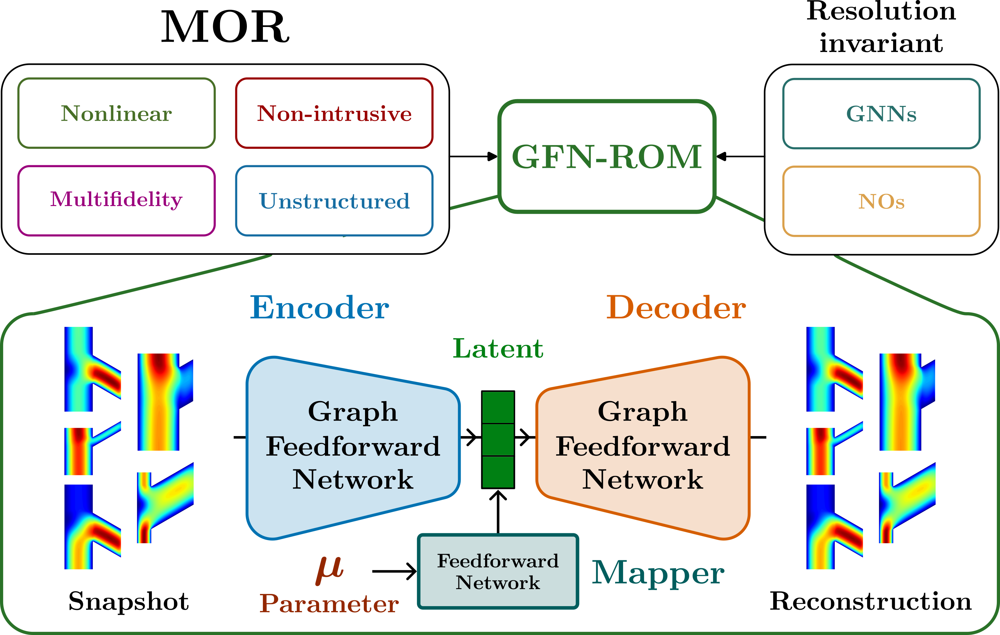

# GFN: A graph feedforward network for resolution-invariant reduced operator learning in multifidelity applications
A resolution-invariant generalisation of feedforward networks for graphical data, applied to model order reduction (MOR).

<p align="center">

</p>

## Why GFNs?
Many applications rely upon graphical data, which standard machine learning methods such as feedforward networks and convolutions cannot handle. GFNs present a novel approach of tackling this problem by extending existing machine learning approaches for use on graphical data. GFNs have very close links with neural operators and graph neural networks.

<p align="center">

</p>

Key advantages of GFNs:
- Resolution invariance
- Equivalence to feedforward networks for single fidelity data (no deterioration in performance)
- Provable guarantees on performance for super- and sub-resolution
- Both fixed and adapative multifidelity training possible

## GFN-ROM
We show the capability of GFNs for MOR by developing the graph feedforward network reduced order model (GFN-ROM).

Key advantages of GFN-ROM:
- First graph-based resolution-invariant ROM
- Lightweight and flexible architecture
- Computational efficiency
- Excellent generalisation performance
- Adaptive multifidelity training

## Cite this work!
If this work is useful to you, please cite
```
In preparation
```
